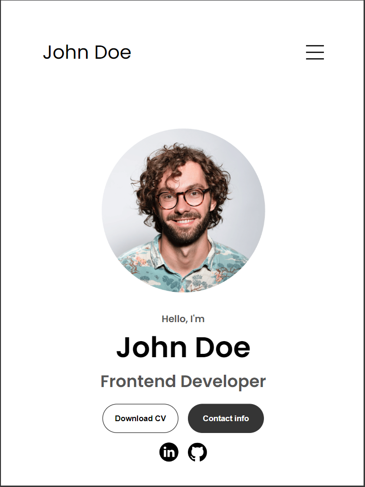

# John Doe - Fullstack Developer

This website is a personal portfolio for John Doe, a Fullstack Developer. The site is designed to showcase his professional experience, skills, education, and projects. It provides an overview of his technical capabilities and personal achievements, serving as a digital resume for potential employers or clients.

---

## Contents

* [User Experience](#user-experience-ux)
  * [User Stories](#user-stories)
* [Design](#design)
    * [Typography](#typography)
    * [Wireframes](#wireframes)
* [Features](#features)
    * [General Features on Each Page](#general-features-on-each-page)
    * [Accessibility](#accessibility)
* [Technologies Used](#technologies-used)
    * [Languages Used](#languages-used)
* [Deployment & Local Development](#deployment--local-development)
  * [Deployment](#deployment)
  * [Local Development](#local-development)
    * [How to Fork](#how-to-fork)
    * [How to Clone](#how-to-clone)
* [Testing](#testing)
* [Credits](#credits)
    * [Code Used](#code-used)
    * [Content](#content)
    * [Media](#media)
    * [Acknowledgments](#acknowledgments)

---

### User Stories

To ensure the website meets the needs of its users, the following user stories were considered:

1. **As a Job Seeker**, I want to view John Doe's professional experience and projects, so I can evaluate his suitability for a position at my company.
   
2. **As a Client**, I want to see examples of John Doe's past work and skills, so I can decide if he is the right fit for a project I have in mind.

3. **As a Fellow Developer**, I want to learn about the technologies John Doe is proficient in and view the code of his projects, so I can gauge his technical skills and consider potential collaboration.

4. **As a Recruiter**, I want to download John Doe’s resume, so I can review it offline and share it with my hiring team.

5. **As a Visitor**, I want to easily navigate through different sections of the website, so I can quickly find the information I'm looking for.

6. **As a User on Mobile Devices**, I want to have a responsive experience with all features accessible and easy to use, so I can browse the portfolio conveniently on my phone or tablet.

---

