# John Doe - Fullstack Developer

This website is a personal portfolio for John Doe, a Fullstack Developer. The site is designed to showcase his professional experience, skills, education, and projects. It provides an overview of his technical capabilities and personal achievements, serving as a digital resume for potential employers or clients.

 

Quick link to deployed website - https://gberrow.github.io/MS1/

---

## Contents

- [User Experience (UX)](#user-experience-ux)
  - [Client Goals](#client-goals)
  - [User Stories](#user-stories)
- [Design](#design)
  - [Colour Scheme](#colour-scheme)
  - [Typography](#typography)
  - [Wireframes](#wireframes)
- [Features](#features)
  - [General Features on Each Page](#general-features-on-each-page)
  - [Accessibility](#accessibility)
  - [Future Implementations](#future-implementations)
- [Technologies Used](#technologies-used)
  - [Languages Used](#languages-used)
  - [Tools and Platforms](#tools-and-platforms)
- [Deployment and Local Development](#deployment-and-local-development)
  - [Deployment](#deployment)
  - [Local Development](#local-development)
    - [How to Fork](#how-to-fork)
    - [How to Clone](#how-to-clone)
- [Testing](#testing)
  - [Full Device and Browser Testing](#full-device-and-browser-testing)
  - [Mobile Responsiveness Testing](#mobile-responsiveness-testing)
  - [Cross Browser Console Output Testing](#cross-browser-console-output-testing)
  - [Edge Case Testing](#edge-case-testing)
  - [Broken Links Testing](#broken-links-testing)
  - [Conclusion](#conclusion)
- [Credits](#credits)
  - [Code Contributions](#code-contributions)
  - [Content Creation](#content-creation)
  - [Media and Graphics](#media-and-graphics)
  - [Tools and Resources](#tools-and-resources)
  - [Acknowledgments](#acknowledgments)

---

## Introduction

Welcome to the personal portfolio website of John Doe, a Fullstack Developer with a passion for creating dynamic and user-friendly web applications. This website serves as a comprehensive digital resume and portfolio, showcasing John Doe's professional experience, technical skills, educational background, and a curated collection of his projects.

The primary purpose of this website is to provide potential employers, clients, and collaborators with an in-depth view of John Doe's capabilities and achievements. By presenting detailed information about his skills and work, the site aims to highlight his expertise in both front-end and back-end development, as well as his ability to deliver high-quality software solutions.

Visitors to the website can explore various sections, including an overview of John Doe's career journey, a portfolio of his notable projects, a summary of his technical proficiencies, and contact information for professional inquiries or networking opportunities.

Whether you are a recruiter looking for a talented developer, a client in need of a technical solution, or a fellow developer interested in collaboration, this portfolio provides all the necessary information to understand John Doe's professional journey and what he can bring to your team or project.

To enhance the user experience, the website was built with ease of navigation, responsiveness, and accessibility as key priorities.

---

## User Experience (UX)

The website was designed with the user in mind, prioritizing seamless navigation, mobile responsiveness, and accessibility. By focusing on these key areas, the portfolio ensures that visitors, regardless of their technical background or the device they are using, can easily navigate and interact with the content. Below are the main elements that contribute to a positive user experience:

### Key Considerations:

- **Easy Navigation**:

  - A sticky navigation bar allows users to quickly jump between sections without needing to scroll back up to the top of the page. The navigation is simple, intuitive, and organized in a way that ensures users can easily access key sections like About, Experience, Projects, and Contact.

- **Responsive Design**:

  - The site is fully responsive, ensuring that it adapts seamlessly to different screen sizes and devices, from desktops to smartphones. Using media queries, the layout adjusts to provide an optimal viewing experience on tablets and mobile devices, ensuring usability across platforms.

- **Accessibility**:

  - Accessibility is a priority in the design. The site includes appropriate alt text for images, clearly structured headings, and sufficient contrast between text and background colors to improve readability. Additionally, all interactive elements, such as buttons and links, are designed to be accessible via keyboard navigation.

- **User-Focused Interactions**:
  - The site is designed to provide immediate feedback to user actions. Button hover states, link transitions, and interactive elements offer a polished, professional feel that enhances the user experience.
  - External links, such as those to social media and GitHub, are set to open in a new tab to keep the portfolio easily accessible for visitors.

### Overall Experience:

The goal is to provide a user-friendly, accessible, and responsive experience that makes it easy for potential clients, recruiters, or collaborators to explore John Doe’s professional journey and skills. Whether viewed on a desktop, tablet, or mobile device, the portfolio aims to deliver a streamlined, professional experience that leaves a lasting impression.

---

## Client Goals

The primary objective of this portfolio is to provide a detailed and professional overview of my skills, experience, and achievements. By addressing the following goals, the website ensures that it meets the needs of potential employers, clients, and collaborators:

**Showcase Professional Experience**:

- Highlight my background in front-end development, education, and relevant work experience to demonstrate my expertise and competence in the field.

**Display Portfolio Projects**:

- Provide potential employers and clients with a comprehensive overview of my past projects, including links to live demos and GitHub repositories, to demonstrate my capabilities and technical proficiency.

**Attract Job and Client Opportunities**:

- Present my skill set and achievements in a way that appeals to recruiters and potential clients, encouraging them to reach out for job opportunities or project collaborations.

**Facilitate Easy Contact**:

- Ensure that potential employers, clients, or collaborators can easily contact me through email, LinkedIn, or other social platforms, and provide clear call-to-actions and downloadable resume links.

**Ensure a Seamless User Experience**:

- Build a responsive, user-friendly website that works smoothly across different devices, providing an accessible experience on desktops, tablets, and smartphones.

**Highlight Technical Expertise**:

- Showcase my proficiency in key technologies, such as HTML, CSS, JavaScript, and frameworks, to demonstrate my coding skills and ability to build high-quality projects.

**Establish a Professional Online Presence**:

- Create a strong and positive online presence that positions me as a credible and capable professional, facilitating networking, employment opportunities, or potential collaborations.

---

## User Stories

The website was designed with several key users in mind, ensuring that their needs are met through clear navigation, access to relevant information, and a smooth user experience. The following user stories highlight the main goals for different user types:

1. **As a Job Seeker**, I want to view John Doe's professional experience, education, and recent projects, so I can assess his qualifications and see if his skill set aligns with the roles I am looking to fill at my company.

2. **As a Potential Client**, I want to see examples of John Doe's completed projects, including detailed descriptions and outcomes, so I can determine if he has the expertise to help me with a project I need to complete.

3. **As a Fellow Developer**, I want to explore the technologies and frameworks that John Doe is proficient in, and review the code of his projects, so I can assess his coding style, collaborate on potential open-source projects, or network for future work opportunities.

4. **As a Recruiter**, I want to quickly locate and download John Doe's resume in a downloadable format, so I can easily review his qualifications and share them with my hiring team during the recruitment process.

5. **As a Visitor to the Site**, I want to be able to easily navigate through the different sections of the website, including experience, projects, and contact information, so I can quickly find the relevant information without having to scroll excessively or get lost.

6. **As a Mobile User**, I want to have a responsive and mobile-friendly experience, ensuring that the navigation, images, and interactive elements work seamlessly on my smartphone or tablet, so I can access John Doe's portfolio without usability issues.

---

## Design

The website is designed with a modern and clean aesthetic to ensure a user-friendly experience that aligns with John Doe's professional brand.

### Colour Scheme

The color scheme is minimalist, focusing on three primary colors:

- **Black:** Conveys professionalism and trust.
- **White (#FFFFFF):** Provides a clean and open background.
- **Gray:** Highlights important elements like buttons and links.

Down below is the website in both light and dark mode, showing the constrast in colours
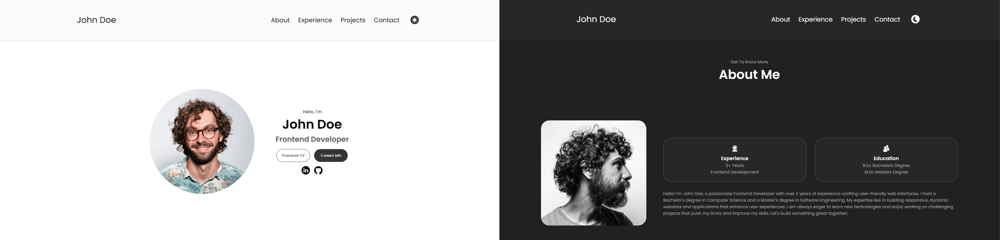

### Typography

I went for a google font Poppins because of it's simple and effective look, making it easy for the eye to read. Below is a screenshot of the font.
Font sizes vary from 16px for regular text to 48px for headers to create a clear hierarchy.

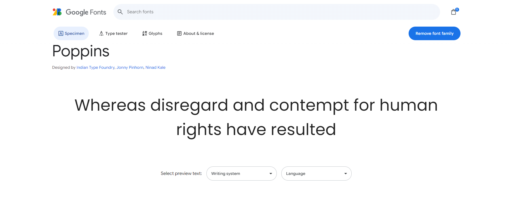 

### Layout and Structure

The website uses a responsive grid layout with CSS Flexbox, optimized for all devices:

- **Header** with a sticky navigation menu.
- **Main content area** for portfolio highlights and skills.
- **Footer** with social links and contact information.

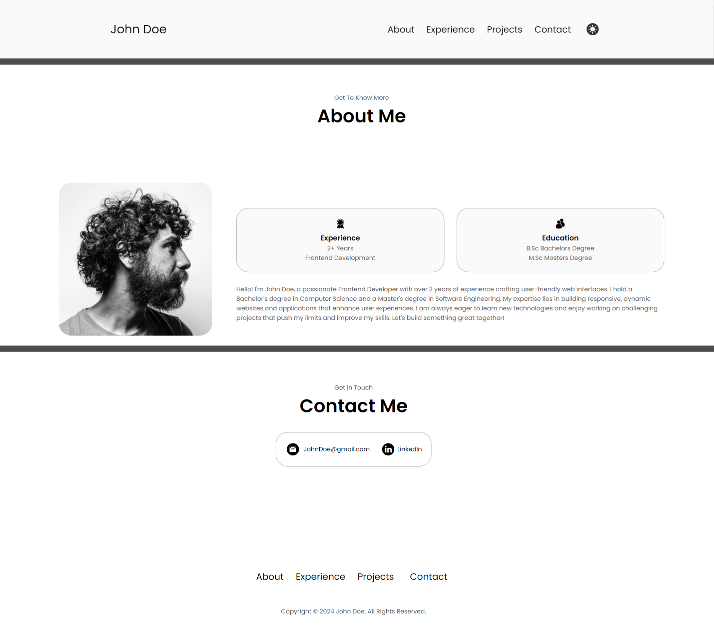

### Wireframes

Only a singular wireframe was created in https://app.diagrams.net/
As the simplicity of the website only needed 1 layout.

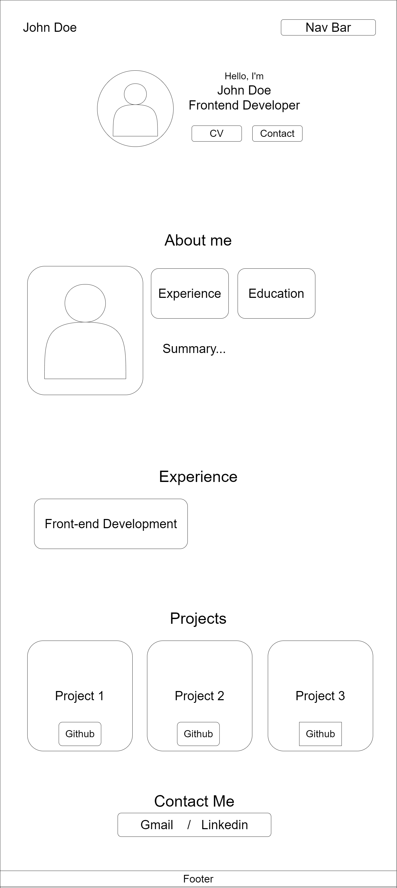 

### User Experience (UX) Considerations

To enhance UX:

- **Responsive Design:** Optimized for desktop, tablet, and mobile.
- **Accessibility:** Ensures compliance with WCAG standards.
- **Intuitive Navigation:** Simple, consistent, and easy to use.

---

## Features

The portfolio website for John Doe includes several features designed to provide a seamless and engaging user experience. This section outlines the general features present on each page, the accessibility measures taken to ensure inclusivity, and potential future implementations to enhance the website further.

### General Features on Each Page

- **Responsive Design**: The website is fully responsive, ensuring optimal viewing and interaction experiences across a wide range of devices (desktops, tablets, and mobile phones). The layout adjusts automatically to the screen size, providing a consistent and user-friendly experience.

- **Navigation Bar**: A sticky navigation bar is present on each page, allowing users to easily navigate to different sections of the website. The navigation bar includes links to Home, About, Projects, Skills, and Contact sections.

- **Call-to-Action Buttons**: Prominent call-to-action buttons are strategically placed throughout the website to encourage user interaction, such as viewing the resume, exploring projects, or getting in touch via the contact form.

- **Project Showcase**: A dedicated Projects section provides an interactive gallery of John Doe's work, complete with images, descriptions, and links to live demos and source code repositories.

- **Contact Form**: The Contact section includes a user-friendly form that allows visitors to send messages directly to John Doe. The form includes validation to ensure the correct format of submitted information.

- **Footer with Social Links**: A footer is present on every page, containing links to John Doe’s social media profiles and GitHub, making it easy for users to connect and follow his professional updates.

### Accessibility

Accessibility is a critical component of the website's design to ensure it is usable by as many people as possible, regardless of their abilities or disabilities. Key accessibility features include:

- **Color Contrast**: The color scheme has been chosen to provide sufficient contrast between text and background, meeting WCAG (Web Content Accessibility Guidelines) standards. This ensures readability for users with visual impairments.

### Future Implementations

To continuously improve the user experience and functionality of the portfolio website, several future implementations are planned:

- **Search Functionality**: Implement a search feature that allows users to quickly find specific content or projects within the website.

- **Enhanced Project Filtering**: Add filtering options in the Projects section to allow users to sort and view projects by technology stack, date, or project type.

- **Blog Section**: Develop a blog section where John Doe can share insights, tutorials, and updates related to web development, fostering engagement with the developer community.

- **Multilingual Support**: Add multilingual support to cater to a broader audience and provide content in different languages.

- **Accessibility Enhancements**: Continuously refine and improve accessibility features based on user feedback and emerging best practices.

By incorporating these features and considering future enhancements, the website aims to provide a comprehensive and inclusive platform that effectively showcases John Doe's skills and achievements while offering a positive user experience for all visitors.

### New Implementations

- **Dark mode**: A dark mode option has been implemented to provide users with the flexibility to switch between light and dark themes based on their preference. This feature enhances user comfort, particularly in low-light environments, reducing eye strain. The dark mode seamlessly adjusts the color scheme of the entire website, ensuring that text remains legible and buttons, links, and other interactive elements are visually distinct. The dark mode toggle is accessible in both desktop and mobile versions, preserving the minimalist and modern aesthetic of the design.

---

## Technologies Used

This portfolio website was developed using a range of modern technologies to ensure a responsive, interactive, and user-friendly experience.

### Languages Used

- **HTML5**: Utilized for the semantic structure of the website, ensuring well-organized content and layout that aligns with accessibility standards.
- **CSS3**: Applied for styling, including responsive design features to adapt the layout to different screen sizes and devices, as well as providing visual appeal with a minimalist, professional look.
- **JavaScript**: Adds interactivity and dynamic content to the website, improving user engagement by enabling features like the dark mode toggle, form validation, and responsive navigation.

### Tools and Platforms

- **Git**: Used for version control, tracking all changes to the codebase and enabling efficient collaboration through branching, merging, and issue tracking.
- **GitHub**: Hosts the project repository, allowing for collaboration, version control, and easy access to the codebase for contributors or potential employers. GitHub Pages could also be used to deploy the project.
- **Gitpod**: A cloud-based Integrated Development Environment (IDE) that integrates seamlessly with GitHub, providing a consistent development environment with pre-configured extensions, auto-save features, and collaboration tools.
- **Google Fonts**: Enhances the website’s typography with the use of the "Poppins" font, ensuring that the text is modern, clean, and readable across various devices and screen sizes.
- **Imageonline**: A web-based tool used to merge and edit images, particularly for creating professional presentations of wireframes, designs, or screenshots.
- **Dead Link Checker**: Ensures all links within the website are functional, preventing broken links and improving the overall user experience and professionalism of the site.
- **Developer Tools**: Browser-based tools like Chrome DevTools and Firefox Developer Edition are used to inspect elements, debug JavaScript, monitor network activity, and test the website’s performance and responsiveness across multiple devices.
- **This Person Does Not Exist**: AI-generated human faces were used to represent placeholder profile images for demonstration purposes, adding a realistic touch to the portfolio.
- **Font Awesome**: A library of scalable vector icons that enhance visual elements such as navigation, social media links, and buttons, contributing to both the aesthetics and usability of the website.
- **Prettier Code Formater**: Automatically formats code to ensure consistent styling, making the codebase easier to read and maintain, reducing errors, and improving collaboration.

---

## Deployment and Local Development
  
This section provides details on how to deploy the portfolio website and how to set up the project for local development. It includes instructions for both deployment to a live server and running the website locally on your machine.

### Deployment

This website is deployed using **GitHub Pages**, which provides a simple and free hosting solution directly integrated with the GitHub repository. Follow these steps to deploy the website:

### Local Development

#### How to Fork

To fork the repository:

1. Log in (or sign up) to Github.
2. Go to the repository for this project, /GBerrow/MS1
3. Click the Fork button in the top right corner.

#### How to Clone

1. Log into your account on github
2. Go to the repository of this project /GBerrow/MS1
3. Click on the code button, and copy your preferred clone link.
4. Open the terminal in your code editor and change the current working directory to the location you want to use for the cloned directory.
5. Type 'git clone' into the terminal, paste the link you copied in step 3 and press enter.

---

## Testing

## Manual testing

In addition to using automated tools such as the W3C HTML Validator and Lighthouse to check for code quality, performance, and accessibility, manual testing was performed to ensure that all interactions, including navigation, form submissions, button functionality, and media links, work as expected. This involved thoroughly checking user experience to confirm that the site provides consistent and intuitive functionality.

### Jigsaw CSS Validator

[Jigsaw](https://jigsaw.w3.org/css-validator/validator) The validation returned no errors or warnings, confirming that the CSS follows all standards and best practices. Ensuring CSS is error-free improves cross-browser compatibility and helps maintain a consistent design across all devices.

_Screenshot showing successful CSS validation with no errors._

### W3C HTML Validator

[W3C Validator](https://validator.w3.org/) Was used to validate the HTML on all pages of the website. The HTML code passed without any errors, ensuring the markup is clean and follows HTML5 standards. Valid HTML is crucial for ensuring that the site renders correctly across different browsers and devices, improving accessibility and user experience.

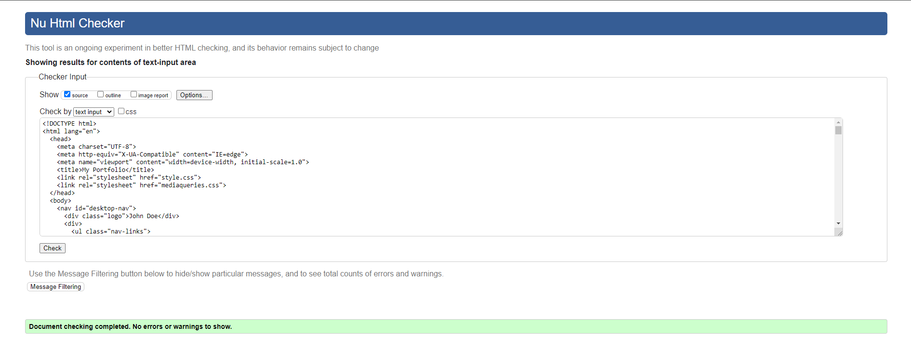
_Screenshot showing successful HTML validation with no errors._

### Lighthouse

Chrome's Lighthouse developer tool was utilized to evaluate the website’s performance, accessibility, best practices, and SEO. The site scored high in all categories, demonstrating its optimization and adherence to web standards. These high scores indicate that the website provides a fast, accessible, and well-optimized experience for all users.

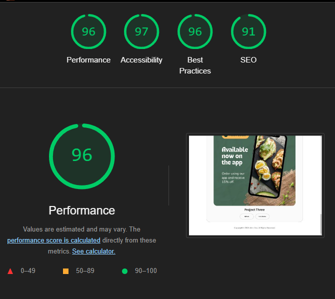
_Screenshot of Lighthouse results showing high scores in Performance, Accessibility, Best Practices, and SEO._

**Performance Summary**:

- **Performance**: Scored 90+ in performance metrics, indicating fast loading times, optimized resources, and efficient handling of scripts and stylesheets. Techniques such as image compression and minimizing CSS/JavaScript were used to ensure fast loading times.
- **Accessibility**: Achieved a high accessibility score by adhering to WCAG standards, such as providing sufficient color contrast, using semantic HTML tags, and including alt text for images. This ensures that all users, including those with disabilities, can navigate the site effectively.
- **Best Practices and SEO**: Scored 90+ in best practices and SEO. These high scores reflect a secure, well-structured site with appropriate meta tags, mobile-friendly features, and proper use of HTTPS, ensuring that the website ranks well on search engines and is secure for visitors.

### Full Device and Browser Testing

Comprehensive testing was conducted to ensure that all website features function as expected, providing a seamless user experience across different sections of the site:

| Feature              | Expected Outcome                                                                        | Testing Performed            | Result                              | Pass/Fail |
| -------------------- | --------------------------------------------------------------------------------------- | ---------------------------- | ----------------------------------- | --------- |
| **Navbar**           |                                                                                         |                              |                                     |           |
| About Link           | When clicked, the user is redirected to the About page.                                 | Clicked About Link           | Redirected to the About page.       | Pass      |
| Experience Link      | When clicked, the user is redirected to the Experience page.                            | Clicked Experience Link      | Redirected to the Experience page.  | Pass      |
| Projects Link        | When clicked, the user is redirected to the Projects section.                           | Clicked Projects Link        | Redirected to the Projects section. | Pass      |
| Contact Link         | When clicked, the user is redirected to the Contact section.                            | Clicked Contact Link         | Redirected to the Contact section.  | Pass      |
| **Footer**           |                                                                                         |                              |                                     |           |
| Nav                  | When clicked, the user is redirected to the appropriate section they clicked on.        | Clicked About                | Redirected to the About section.    | Pass      |
| **Whole Page**       |                                                                                         |                              |                                     |           |
| Responsive Layout    | The layout adjusts correctly when resizing the browser window.                          | Resized the browser window   | Layout adjusted without breaking.   | Pass      |
| **Contact Page**     |                                                                                         |                              |                                     |           |
| Contact Container    | When clicked, the link in the contact container for Gmail and LinkedIn works correctly. | Clicked on both buttons      | Links open up in a new page.        | Pass      |
| **Projects Section** |                                                                                         |                              |                                     |           |
| Project Demo Buttons | When clicked, the user is redirected to the live project demos.                         | Clicked Project Demo Buttons | Redirected to live project demos.   | Pass      |

### Mobile Responsiveness Testing

The website was tested on various mobile devices to ensure responsiveness and functionality:

- **iPhone SE** (iOS 14)  
  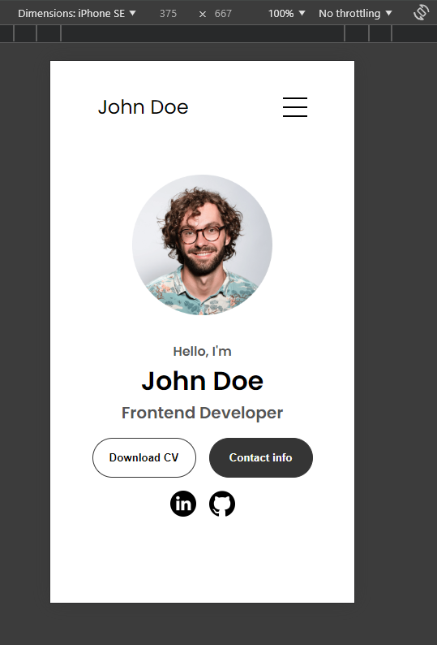

- **Samsung Galaxy S8** (Android 9)  
  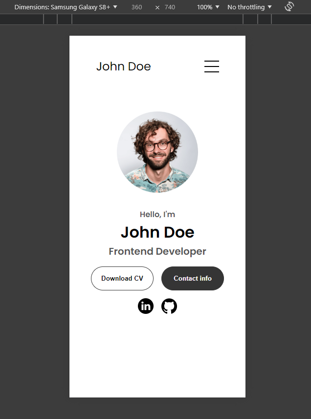

Both portrait and landscape modes were tested to ensure that the layout, images, and interactive elements adjusted correctly. All interactions, such as tapping buttons and submitting forms, worked as expected, with no visual or functional issues identified.

### Cross Browser Console Output Testing

The website was tested using the developer console in each major browser, as shown below:

- **Google Chrome Console Output**
  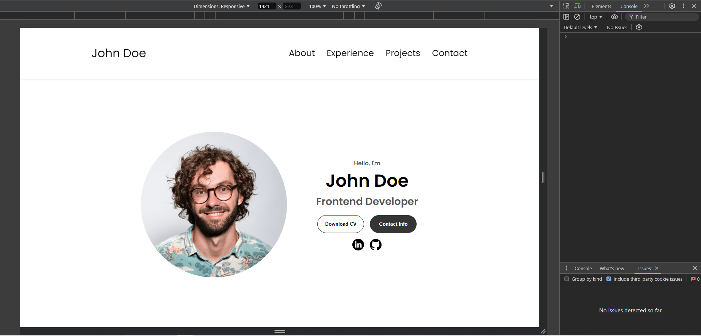

- **Mozilla Firefox Console Output**
  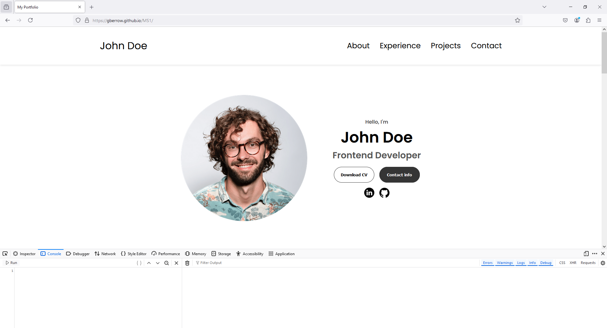

- **Microsoft Edge Console Output**
  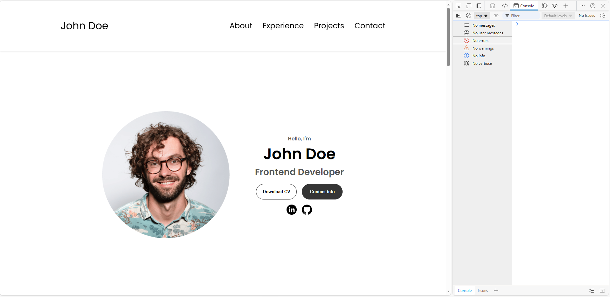

All features, including navigation, media links, and form submissions, worked as expected across these browsers. No significant cross-browser issues were identified, ensuring a smooth and consistent experience for all users.

### Edge Case Testing

Additional tests were conducted to ensure that the website performed well under less-than-ideal conditions:

- **Slow Network Conditions**: The website was tested under simulated Slow 4G speeds to evaluate how efficiently images and resources are loaded. The site performed well, with all critical elements remaining visible and a total load time of 2.8 seconds, which is considered optimal under these conditions.
  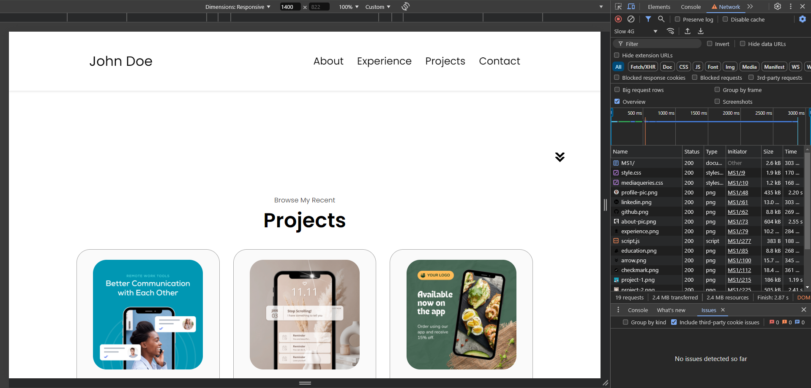

- **Disabled JavaScript**: The website was tested with JavaScript disabled to verify that core functionality remained accessible. Minimal interactive elements were affected, the core content, navigation, and layout were still fully accessible, ensuring a functional experience for users without JavaScript enabled.
  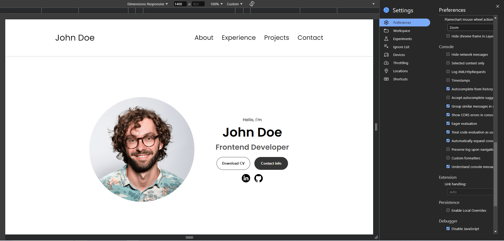

  ### Broken Links Testing

  To ensure that all links on the website are functional and lead to the correct destinations, comprehensive testing for broken links was conducted.

  - **Method**:
    - An automated tool was used to scan the site for broken or inactive links.
    - Each link was also manually tested to ensure proper redirection.

- **Outcome**:
  - All internal and external links were found to be working correctly, with no broken links identified.

Below is a screenshot of the broken link test results:

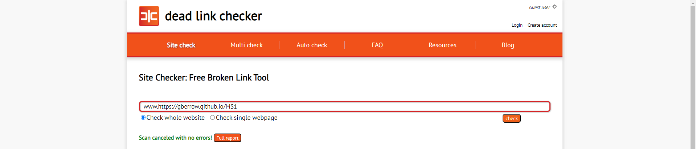

_Screenshot showing successful broken links testing, with no errors found._

### Bug Fixes and Improvements

During testing, the following issues were identified and addressed:

- **Navigation Bar Overlap on Mobile**: The navigation bar overlapped with content on smaller screens. This issue was resolved by adjusting the `z-index` and adding padding.
- **Form Validation on Mobile**: Error messages for the contact form were not displaying correctly on mobile devices. This was resolved by updating the validation script to ensure proper mobile behavior.

### Remaining Bugs

- **Sticky NavBar On Smaller Devices** The sticky navbar feature is effective on larger screens, providing easy navigation without requiring the user to scroll back to the top. However, this feature has been disabled on smaller devices like smartphones and tablets. Since users can scroll more easily on these devices, the sticky navbar is less critical and might also take up valuable screen space, which is why it was excluded from smaller viewports.

## Conclusion

The website has undergone **extensive and thorough testing** across a wide range of devices, browsers, and network conditions to ensure it meets modern standards for performance, accessibility, and usability. From **automated testing** using tools like the **W3C HTML Validator** and **Lighthouse**, to **manual testing** across multiple devices and browsers, every aspect of the site’s functionality was scrutinized to ensure a seamless user experience.

### Key findings from the testing include:

- **Responsive Design**: The website maintained full functionality and a consistent layout on various screen sizes, including mobile devices and tablets.
- **Accessibility**: With high Lighthouse scores and manual accessibility testing, the site adheres to **WCAG standards**, ensuring that it is accessible to users with disabilities.
- **Performance Optimization**: Techniques such as image compression, code minimization, and caching were used to ensure fast load times even on slower network conditions (e.g., Slow 4G).
- **Cross-Browser Compatibility**: The website was thoroughly tested in major browsers such as **Google Chrome**, **Mozilla Firefox**, and **Microsoft Edge**, with no issues encountered, ensuring a smooth experience for all users.

Furthermore, **edge case testing** (such as disabling JavaScript and simulating slow network conditions) confirmed that the site remains functional and accessible even in less-than-ideal circumstances, reinforcing its robustness.

### Moving forward:

Continuous monitoring and periodic testing will be conducted to ensure that the website remains fully functional and optimized as new features or content are added. In particular, as new devices and browsers emerge, further testing will be performed to guarantee that the site adapts to future changes in technology.

In summary, the website is optimized for a wide audience, offering a fast, accessible, and consistent experience across all devices and platforms. All identified issues during testing were promptly addressed, ensuring that users, regardless of their device or network condition, will have a high-quality experience.

---

## Credits

This portfolio website was developed using various tools, resources, and inspirations. Below are key contributions, attributions, and acknowledgments that helped shape this project:

### Code Contributions

- **Custom HTML and CSS**: The entire structure of the website, including the layout and styling, was developed by me. ChatGPT provided assistance in refining the structure and resolving code issues along the way.
- **JavaScript for Interactivity**: I wrote custom JavaScript to manage interactivity on the site, such as toggling between dark and light mode and handling the navigation menu.

### Content Creation

- **Professional Content**: All text content, including project descriptions, professional experience summaries, and skillset details, was created by me. Tools like Prettier and Docker were used to format the content and ensure a clean structure.
- **Contact Information**: Placeholder contact information for John Doe is provided to demonstrate the functionality of the contact section.
- **Layout Inspiration**: The layout concept for this site was inspired by templates available on [W3Schools](https://www.w3schools.com/w3css/w3css_templates.asp), which helped guide the structure and flow of the website.

### Media and Graphics

- **Profile and Placeholder Images**: All images, including the profile picture, were generated through [This Person Does Not Exist](https://this-person-does-not-exist.com/en) to create unique, non-copyrighted visuals.
- **Icons and Visual Elements**: Icons used throughout the site were sourced from [Font Awesome](https://fontawesome.com/), enhancing the visual appeal and usability of the design.

### Tools and Resources

- **Git and GitHub**: Version control for this project was managed using Git and hosted on GitHub, allowing for efficient tracking of changes and collaboration.
- **Gitpod**: Development took place within the Gitpod environment, providing seamless integration of coding, testing, and debugging tools.
- **Prettier Code Formatter**: Prettier was used to maintain consistent code styling, ensuring that the HTML, CSS, and JavaScript are clean and readable.

### Acknowledgments

- **Educational Resources**: This project benefited from tutorials and documentation provided by [MDN Web Docs](https://developer.mozilla.org/) and [W3Schools](https://www.w3schools.com/), which were invaluable for resolving development challenges.
- **Peer Support and Feedback**: Special thanks to friends, family, and peers on Slack for offering valuable feedback and assisting with testing the site across different devices and browsers.
- **Design Inspiration**: Various modern portfolio websites and design showcases served as inspiration, ensuring that the final result is visually appealing and meets current design standards.
