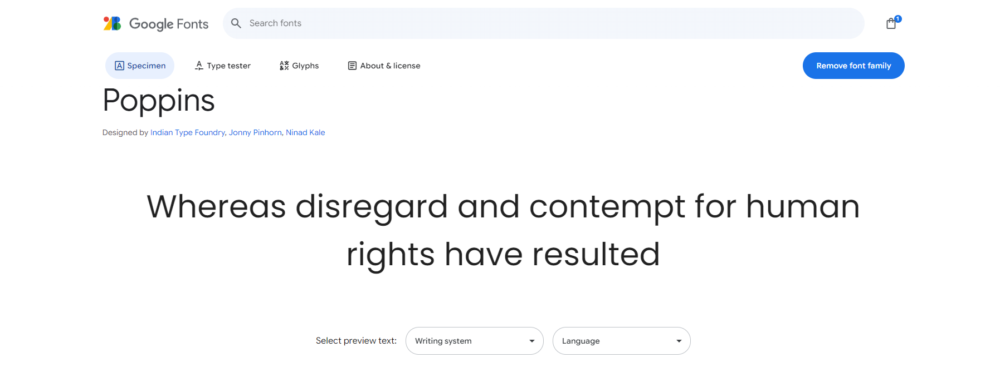
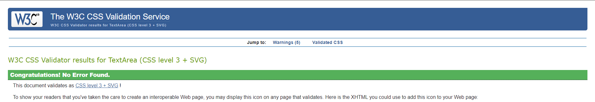
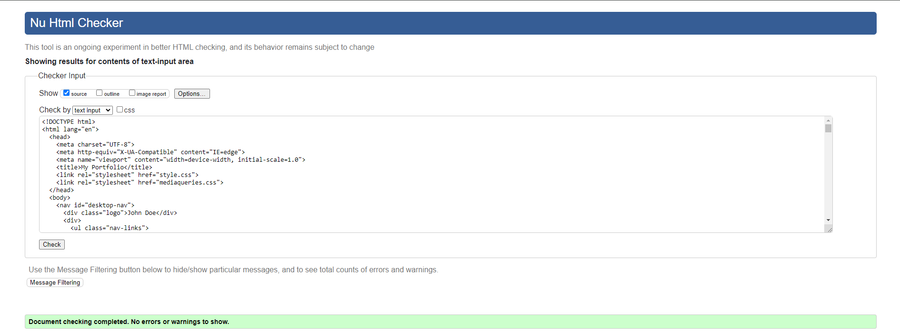
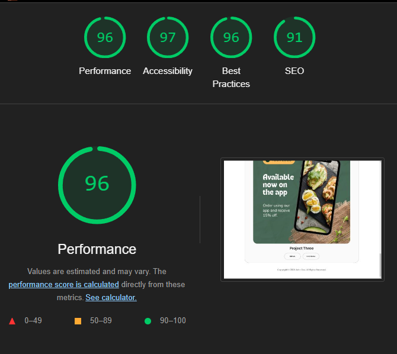

# John Doe - Fullstack Developer

This website is a personal portfolio for John Doe, a Fullstack Developer. The site is designed to showcase his professional experience, skills, education, and projects. It provides an overview of his technical capabilities and personal achievements, serving as a digital resume for potential employers or clients.

 

---

## Contents

* [User Experience](#user-experience-ux)
  * [User Stories](#user-stories)
* [Design](#design)
    * [Colour Scheme](#colour-scheme)
    * [Typography](#typography)
    * [Wireframes](#wireframes)
* [Features](#features)
    * [General Features on Each Page](#general-features-on-each-page)
    * [Accessibility](#accessibility)
    * [Future Implementations](#future-implementations)
* [Technologies Used](#technologies-used)
    * [Languages Used](#languages-used)
    * [Tools and Platforms](#Tools-and-Platforms)
* [Deployment & Local Development](#deployment--local-development)
  * [Deployment](#deployment)
  * [Local Development](#local-development)
    * [How to Fork](#how-to-fork)
    * [How to Clone](#how-to-clone)
* [Testing](#testing)
* [Credits](#credits)
    * [Code Used](#code-used)
    * [Content](#content)
    * [Media](#media)
    * [Acknowledgments](#acknowledgments)

---

## Introduction

Welcome to the personal portfolio website of John Doe, a Fullstack Developer with a passion for creating dynamic and user-friendly web applications. This website serves as a comprehensive digital resume and portfolio, showcasing John Doe's professional experience, technical skills, educational background, and a curated collection of his projects.

The primary purpose of this website is to provide potential employers, clients, and collaborators with an in-depth view of John Doe's capabilities and achievements. By presenting detailed information about his skills and work, the site aims to highlight his expertise in both front-end and back-end development, as well as his ability to deliver high-quality software solutions.

Visitors to the website can explore various sections, including an overview of John Doe's career journey, a portfolio of his notable projects, a summary of his technical proficiencies, and contact information for professional inquiries or networking opportunities.

Whether you are a recruiter looking for a talented developer, a client in need of a technical solution, or a fellow developer interested in collaboration, this portfolio provides all the necessary information to understand John Doe's professional journey and what he can bring to your team or project.

---

## User Stories

The following user stories were carefully crafted to address the key needs and goals of different types of users interacting with the website:

1. **As a Job Seeker**, I want to view John Doe's professional experience, education, and recent projects, so I can assess his qualifications and see if his skill set aligns with the roles I am looking to fill at my company.

2. **As a Potential Client**, I want to see examples of John Doe's completed projects, including detailed descriptions and outcomes, so I can determine if he has the expertise to help me with a project I need to complete.

3. **As a Fellow Developer**, I want to explore the technologies and frameworks that John Doe is proficient in, and review the code of his projects, so I can assess his coding style, collaborate on potential open-source projects, or network for future work opportunities.

4. **As a Recruiter**, I want to quickly locate and download John Doe's resume in a downloadable format, so I can easily review his qualifications and share them with my hiring team during the recruitment process.

5. **As a Visitor to the Site**, I want to be able to easily navigate through the different sections of the website, including experience, projects, and contact information, so I can quickly find the relevant information without having to scroll excessively or get lost.

6. **As a Mobile User**, I want to have a responsive and mobile-friendly experience, ensuring that the navigation, images, and interactive elements work seamlessly on my smartphone or tablet, so I can access John Doe's portfolio without usability issues.

---

## Design

The website is designed with a modern and clean aesthetic to ensure a user-friendly experience that aligns with John Doe's professional brand.

### Color Scheme
The color scheme is minimalist, focusing on three primary colors:

- **Black:** Conveys professionalism and trust.
- **White (#FFFFFF):** Provides a clean and open background.
- **Gray:** Highlights important elements like buttons and links.

### Typography

I went for a google font Poppins because of it's simple and effective look, making it easy for the eye to read. Below is a screenshot of the font.
Font sizes vary from 16px for regular text to 48px for headers to create a clear hierarchy.

 

### Layout and Structure
The website uses a responsive grid layout with CSS Flexbox, optimized for all devices:

- **Header** with a sticky navigation menu.
- **Main content area** for portfolio highlights and skills.
- **Footer** with social links and contact information.

### Wireframes
Only a singular wireframe was created in https://app.diagrams.net/ 
As the simplicity of the website only needed 1 layout. 

 

### User Experience (UX) Considerations
To enhance UX:
- **Responsive Design:** Optimized for desktop, tablet, and mobile.
- **Accessibility:** Ensures compliance with WCAG standards.
- **Intuitive Navigation:** Simple, consistent, and easy to use.

---

## Features

The portfolio website for John Doe includes several features designed to provide a seamless and engaging user experience. This section outlines the general features present on each page, the accessibility measures taken to ensure inclusivity, and potential future implementations to enhance the website further.

### General Features on Each Page

- **Responsive Design**: The website is fully responsive, ensuring optimal viewing and interaction experiences across a wide range of devices (desktops, tablets, and mobile phones). The layout adjusts automatically to the screen size, providing a consistent and user-friendly experience.

- **Navigation Bar**: A sticky navigation bar is present on each page, allowing users to easily navigate to different sections of the website. The navigation bar includes links to Home, About, Projects, Skills, and Contact sections.

- **Call-to-Action Buttons**: Prominent call-to-action buttons are strategically placed throughout the website to encourage user interaction, such as viewing the resume, exploring projects, or getting in touch via the contact form.

- **Project Showcase**: A dedicated Projects section provides an interactive gallery of John Doe's work, complete with images, descriptions, and links to live demos and source code repositories.

- **Contact Form**: The Contact section includes a user-friendly form that allows visitors to send messages directly to John Doe. The form includes validation to ensure the correct format of submitted information.

- **Footer with Social Links**: A footer is present on every page, containing links to John Doe’s social media profiles and GitHub, making it easy for users to connect and follow his professional updates.

### Accessibility

Accessibility is a critical component of the website's design to ensure it is usable by as many people as possible, regardless of their abilities or disabilities. Key accessibility features include:

- **Color Contrast**: The color scheme has been chosen to provide sufficient contrast between text and background, meeting WCAG (Web Content Accessibility Guidelines) standards. This ensures readability for users with visual impairments.

### Future Implementations

To continuously improve the user experience and functionality of the portfolio website, several future implementations are planned:

- **Dark Mode**: Introduce a dark mode feature to enhance user comfort during nighttime browsing and cater to user preferences.

- **Search Functionality**: Implement a search feature that allows users to quickly find specific content or projects within the website.

- **Enhanced Project Filtering**: Add filtering options in the Projects section to allow users to sort and view projects by technology stack, date, or project type.

- **Blog Section**: Develop a blog section where John Doe can share insights, tutorials, and updates related to web development, fostering engagement with the developer community.

- **Multilingual Support**: Add multilingual support to cater to a broader audience and provide content in different languages.

- **Accessibility Enhancements**: Continuously refine and improve accessibility features based on user feedback and emerging best practices.

By incorporating these features and considering future enhancements, the website aims to provide a comprehensive and inclusive platform that effectively showcases John Doe's skills and achievements while offering a positive user experience for all visitors.

---

## Technologies Used

This portfolio website was built using a variety of technologies to ensure a modern, responsive, and interactive user experience.

### Languages Used

- **HTML5**: The structure of the website is built with HTML5, providing a semantic foundation for the content and layout.
- **CSS3**: CSS3 is used for styling the website, ensuring a visually appealing and responsive design that adapts to various devices and screen sizes.
- **JavaScript**: JavaScript is utilized to add interactive elements and enhance the user experience with dynamic content.

### Tools and Platforms

- **Git**: Version control is managed with Git, allowing for efficient tracking of changes and collaboration.
- **GitHub**: The project is hosted on GitHub, providing a platform for version control and collaborative development.
- **Gitpod**: The development environment used for coding, featuring extensions and tools that streamline the development process.
- **Google Fonts**: Custom fonts from Google Fonts are used to improve the site's typography and overall aesthetic appeal.

---

## Deployment & Local Development

This section provides details on how to deploy the portfolio website and how to set up the project for local development. It includes instructions for both deployment to a live server and running the website locally on your machine.

### Deployment

This website is deployed using **GitHub Pages**, which provides a simple and free hosting solution directly integrated with the GitHub repository. Follow these steps to deploy the website:

### Local Development

#### How to Fork

To fork the repository:

1. Log in (or sign up) to Github.
2. Go to the repository for this project, /GBerrow/MS1
3. Click the Fork button in the top right corner.

#### How to Clone

1. Log into your account on github
2. Go to the repository of this project /GBerrow/MS1
3. Click on the code button, and copy your preferred clone link.
4. Open the terminal in your code editor and change the current working directory to the location you want to use for the cloned directory.
5. Type 'git clone' into the terminal, paste the link you copied in step 3 and press enter.

---

## Testing

Comprehensive testing was performed to ensure the website is fully functional, responsive, and accessible across different devices and browsers. The following tools and methods were used to validate and test the website:

### Jigsaw CSS Validator

[Jigsaw](https://jigsaw.w3.org/css-validator/validator) was used to validate the CSS code. The validation returned no errors or warnings, confirming that the CSS follows all standards and best practices.

*Screenshot showing successful CSS validation with no errors.*

### W3C HTML Validator

[W3C Validator](https://validator.w3.org/) was used to validate the HTML on all pages of the website. The HTML code passed without any errors, ensuring the markup is clean and follows HTML5 standards.

*Screenshot showing successful HTML validation with no errors.*

### Lighthouse

Chrome's Lighthouse developer tool was utilized to evaluate the website’s performance, accessibility, best practices, and SEO. The site scored high in all categories, demonstrating its optimization and adherence to web standards.

*Screenshot of Lighthouse results showing high scores in Performance, Accessibility, Best Practices, and SEO.*

**Performance Summary**:
- **Performance**: Scored 90+ in performance metrics, indicating fast loading times and optimized resources.
- **Accessibility**: Achieved a high accessibility score by adhering to WCAG standards, ensuring all users, including those with disabilities, can navigate the site effectively.
- **Best Practices and SEO**: Scored 90+ in best practices and SEO, reflecting a well-structured site with proper meta tags and secure practices.

### Full Device and Browser Testing

Full testing was performed on the following devices to ensure the website is fully responsive and functional:

* **Laptop**:
  * Asus Laptop running Windows 10
* **Mobile Devices**:
  * iPhone SE running iOS 14
  * Samsung Galaxy S8 running Android 9

The site was tested using the following browsers:

* **Google Chrome** - Version 92+
* **Safari** - Version 14+
* **Microsoft Edge** - Version 92+

### Functional Testing

Extensive functional testing was performed to ensure that all interactive elements work as expected:

- **Navigation**: All navigation links were tested to ensure they direct to the correct sections or pages.
- **Forms**: The contact form was tested for validation and successful submission. All required fields were checked to ensure they display appropriate error messages when not filled in correctly.
- **Buttons**: All buttons were tested to ensure they trigger the correct actions.

### Accessibility Testing

In addition to Lighthouse, manual accessibility testing was performed using screen readers (NVDA) to ensure all content is accessible. Keyboard navigation was tested to ensure all interactive elements are accessible and operable without a mouse.

### Conclusion

The website has been thoroughly tested and validated across multiple devices, browsers, and platforms to ensure it provides a consistent, accessible, and high-quality user experience. Any issues found during testing were resolved to ensure optimal performance and accessibility.

---
## Credits

This portfolio website was developed with the help of various tools, resources, and inspirations. Below is a list of the key contributions and attributions:

### Code Used

- **Custom HTML and CSS**: All HTML and CSS used in this project were written by me, but I used ChatGPT to help structure and fix any mistakes I have made 
- **JavaScript for Interactivity**: Custom JavaScript was written by myself to handle interactive elements.

### Content

- **Professional Content**: All text, including descriptions of projects, professional experiences, and skills, was created by Myself. I have used a couple of extensions like Prettier formarter and Docker and to help strucutre my content. 
- **Contact Information**: John Doe's contact information and professional details are included to provide a way for potential employers or collaborators to reach out.
- **Website Layout** : My idea for the template of my website was inspired from (https://www.w3schools.com/w3css/w3css_templates.asp). They have endless templates for you to use and help get your project underway. 

### Media

- **Images**: All images used in the project are generated from ChatGPT image generator and (https://this-person-does-not-exist.com/en)

### Acknowledgments

- **Online Resources and Tutorials**: The development of this site was supported by tutorials and documentation available on platforms like [MDN Web Docs](https://developer.mozilla.org/) and [W3Schools](https://www.w3schools.com/).
- **Feedback and Testing**: Special thanks to friends, family, and peers (On Slack) who provided feedback and helped test the website across different devices and browsers.
- **Inspiration**: Various design inspirations were taken from popular portfolio websites and web design showcases to ensure the website meets modern standards and expectations.

